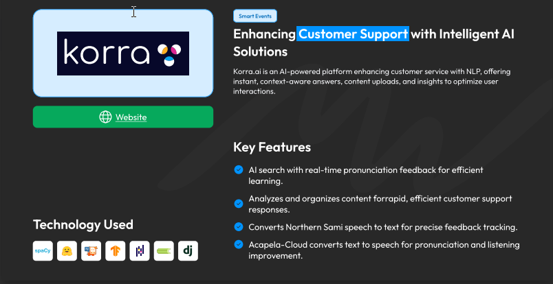
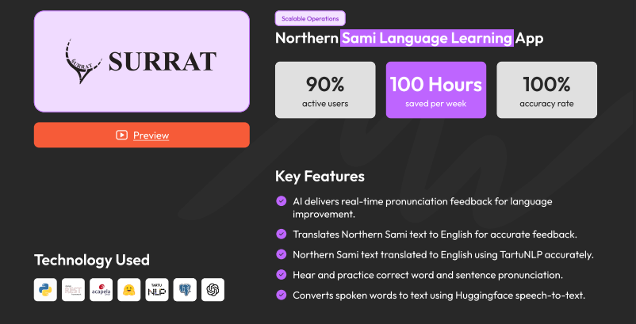
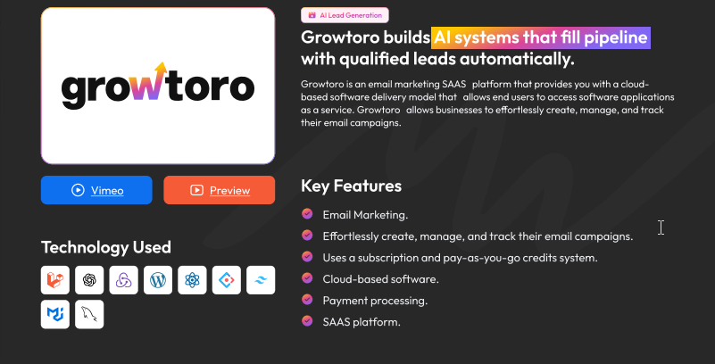
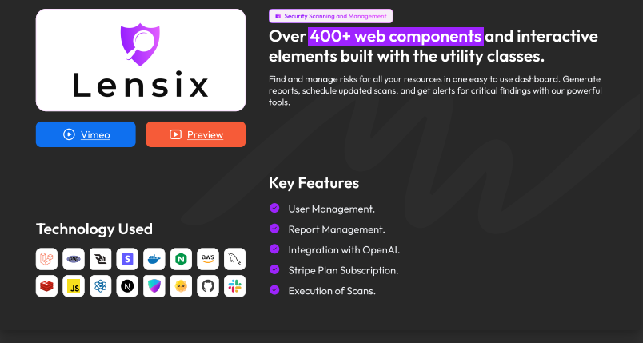
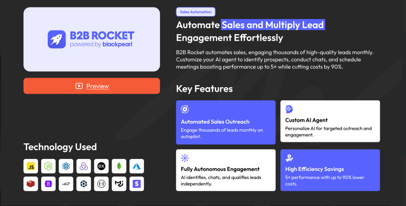
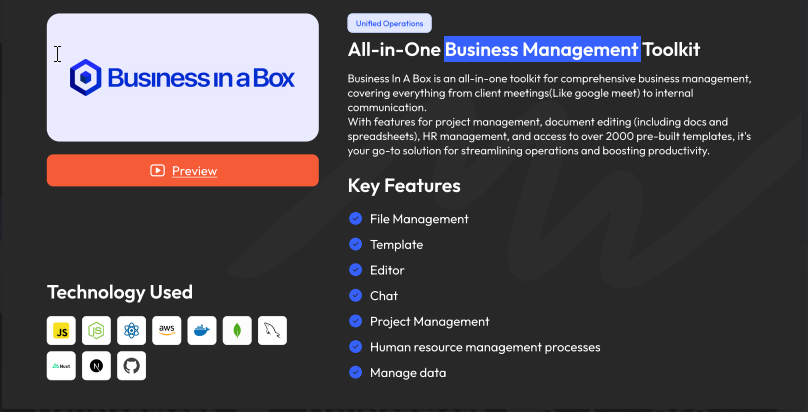
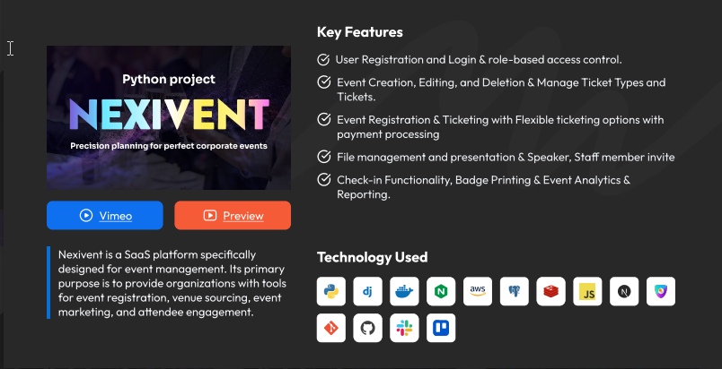
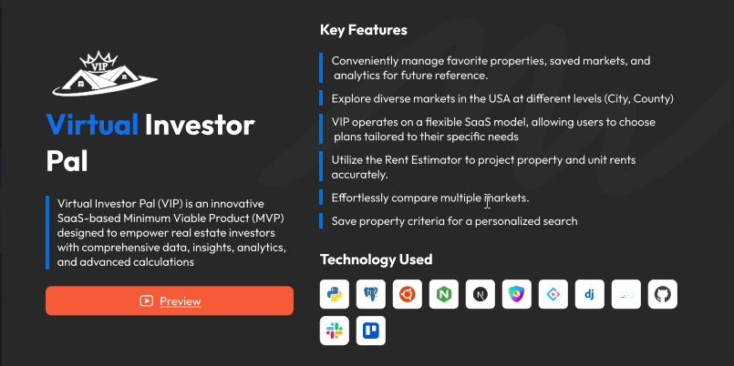
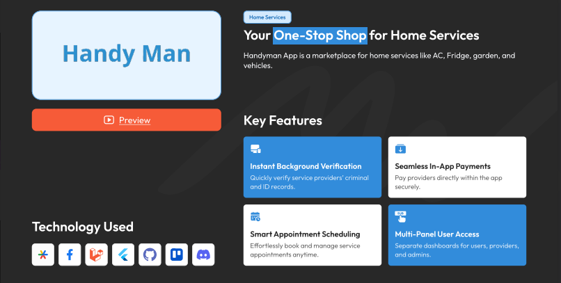
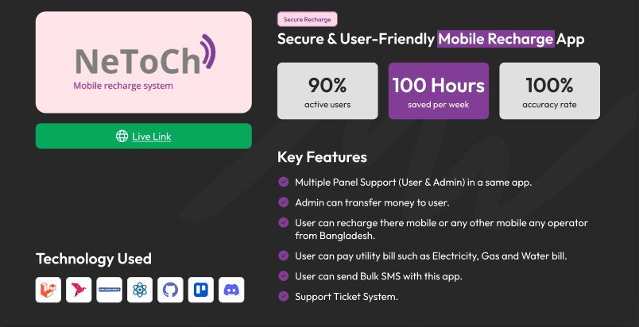

<div align="center">

<!-- DYNAMIC HEADER · Mediusware.com logo color (00d4aa) -->


<!-- BADGES ROW -->
[](https://mediusware.com/)
[](https://www.linkedin.com/company/mediusware)
[](https://www.youtube.com/@mediuswareltd)
[](https://mediusware.com/blog)

</div>

<!-- TYPING SVG -->
<div align="center">
<a href="https://git.io/typing-svg"></a>
</div>

<br/>

<!-- ABOUT MEDIUSWARE -->
##  &nbsp;About Mediusware

```yaml
company: Mediusware
location: Dhaka, Bangladesh
industry: Software Development
website: https://mediusware.com

mission: Build reliable, scalable software without compromise.
vision: Become Bangladesh's #1 globally trusted software brand.
```

**We help mid-market & enterprise companies accelerate digital transformation.**  
10+ years. 850+ projects. 100% on-time. 5⭐ rating . 750+ happy clients.

- **What we do:** Custom software, AI/ML, web & mobile development, team extensions
- **Why choose us:** Cost-effective (50–70% vs US hiring), agile-first, expert teams in React, Node, Python, AI
- **Contact:** [sales@mediusware.com](mailto:sales@mediusware.com) · [mediusware.com](https://mediusware.com)

<br/>

<!-- WHAT I'M BUILDING -->
## 🔥 Projects & Repositories

### 🤖 AI/ML

<div align="center">
  
</div>

<div align="center">
  
</div>

---

### 🌱 PHP (Laravel)

<div align="center">
  
</div>

<div align="center">
  
</div>

---

### ⚡ JavaScript (TypeScript)

<div align="center">
  
</div>

<div align="center">
  
</div>

---

### 🐍 Python (Django / Flask)

<div align="center">
  
</div>

<div align="center">
  
</div>

---

### 📱 Mobile Application

<div align="center">
  
</div>

<div align="center">
  
</div>

---

<div align="center">

[](https://github.com/mediusware)

</div>

<br/>

<!-- TECH STACK -->
## 🛠️ Technology Arsenal

<div align="center">

### ⚡ Backend & Languages


### 🎨 Frontend & Frameworks


### ☁️ Cloud & DevOps


### 🧠 AI & Data


### 🛠️ Tools


### 🔐 Security


</div>

<br/>

## 📊 GitHub Analytics

<div align="center">
  <a href="https://github.com/shaheen2013">
    
  </a>
  <a href="https://github.com/shaheen2013">
    
  </a>
</div>

<div align="center">
  <a href="https://github.com/shaheen2013">
    
  </a>
</div>

<div align="center">
  
</div>

<br/>

<!-- BUSINESSES -->
## 🏢 Mediusware

<div align="center">

  <br/><br/>
  <b>Your Global Tech Partner</b><br/>
  <sub>AI/ML · Web Development · Mobile Development · UI/UX Design · 10+ Years · 850+ Projects · 4.9★</sub>

</div>

<br/>

<br/>

<!-- YOUTUBE -->
## 📺 Mediusware on YouTube

<div align="center">

> **Mediusware Ltd** — Tech, tutorials & updates from the team.
>
> [**▶ Subscribe @ Mediusware →**](https://www.youtube.com/@mediuswareltd)

</div>

<br/>

<!-- CONNECT -->
## 🤝 Let's Connect

<div align="center">

[](https://mediusware.com/)
[](https://www.linkedin.com/company/mediusware)
[](https://github.com/mediusware)
[](https://www.youtube.com/@mediuswareltd)
[](mailto:sales@mediusware.com)

</div>

<br/>

<!-- STATS -->
<div align="center">

**10+ Years** · **120+ Engineers** · **850+ Projects** · **750+ Happy Clients** · **5⭐**

</div>

<br/>

<!-- FOOTER -->


<div align="center">
  <b>💡 Your Global Tech Partner</b><br/><br/>
  <sub>⚡ Software Development · AI/ML · Web & Mobile · UI/UX · Dhaka, Bangladesh</sub>
</div>
