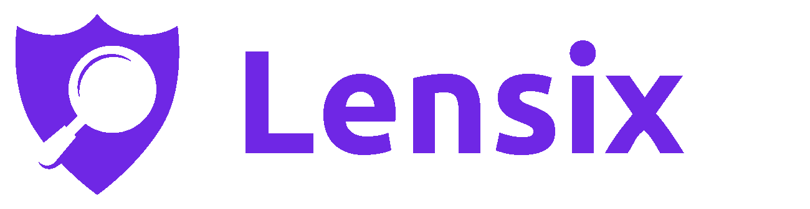
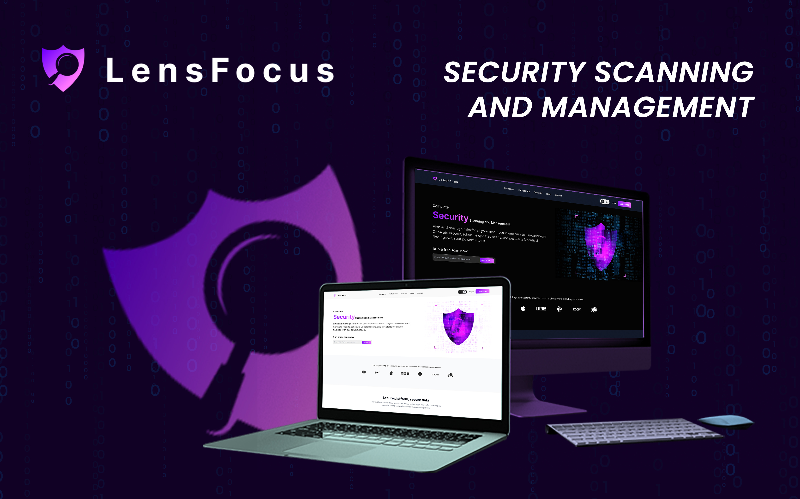
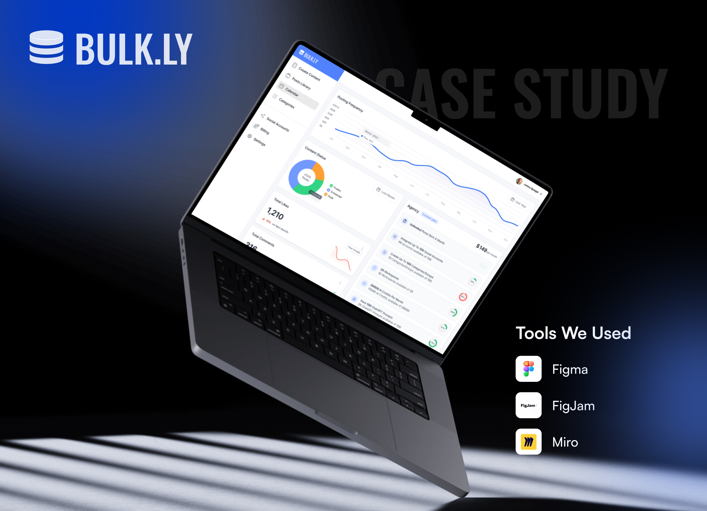
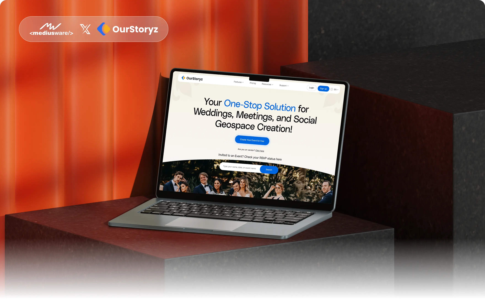

<!-- DYNAMIC HEADER -->

 

**120+ Engineers &nbsp;·&nbsp; 850+ Projects &nbsp;·&nbsp; 10+ Years &nbsp;·&nbsp; 5⭐**

 

 

---

## Trusted by companies worldwide

**USA &nbsp;·&nbsp; UK &nbsp;·&nbsp; Australia &nbsp;·&nbsp; Canada &nbsp;·&nbsp; UAE &nbsp;·&nbsp; Europe**

 

<picture>
  <source media="(prefers-color-scheme: light)" srcset="portfolios/logos/bulkly-light.png">
  
</picture>&nbsp;&nbsp;&nbsp;
<picture>
  <source media="(prefers-color-scheme: light)" srcset="portfolios/logos/lensix-light.png">
  
</picture>&nbsp;&nbsp;&nbsp;
<picture>
  <source media="(prefers-color-scheme: light)" srcset="portfolios/logos/nexivent-light.png">
  
</picture>&nbsp;&nbsp;&nbsp;
<picture>
  <source media="(prefers-color-scheme: light)" srcset="portfolios/logos/housebrands-light.png">
  
</picture>&nbsp;&nbsp;&nbsp;
<picture>
  <source media="(prefers-color-scheme: dark)" srcset="portfolios/logos/ourstoryz-dark.png">
  
</picture>

 

| | |
|:---|:---|
| ✦ 82% reduction in scheduling time for a global Martech SaaS client | ✦ SaaS platforms now serving 100K+ active users across 10+ countries |
| ✦ Served clients across Healthcare, E-commerce, Real Estate, Event Management & Martech | ✦ 100% on-time delivery across 850+ engagements worldwide |

 

---

## What We Build

| 🤖 AI & Automation | 🚀 SaaS & Product Engineering | 📱 Web & Mobile |
|:---:|:---:|:---:|
| Custom AI/ML systems, LLM integrations, workflow automation & intelligent agents | End-to-end product development for global SaaS — from MVP to enterprise scale | React, Next.js, React Native & cross-platform mobile delivery |

 

---

## Selected Work

### 🤖 AI & Automation

  
   Korra AI — AI-powered assistant platform · intelligent customer support automation

 

  
   LensFocus — Healthcare AI with OpenAI integration · 70% less manual auditing · 100K+ active users

 

### 🚀 SaaS & Product Engineering

  
   Nexivent — Event management SaaS · 2.4x execution efficiency · 40% smoother entry experience

 

  
   Bulk.ly — Social media automation SaaS · 82% less scheduling time · 2.4x posting frequency

 

### 📱 Web & Mobile

  
   Housebrands — B2B & B2C eCommerce platform · 3.2x more interactions · 60% less manual communication

 

  
   OurStoryz — Event booking platform · 42% more bookings · 2.4x faster RSVP collection

 

 

---

## Our Core Stack

 

---

## Work With Us

**Ready to build something great?** 
Let's talk about your project.

 

[**sales@mediusware.com**](mailto:sales@mediusware.com)

 

 

